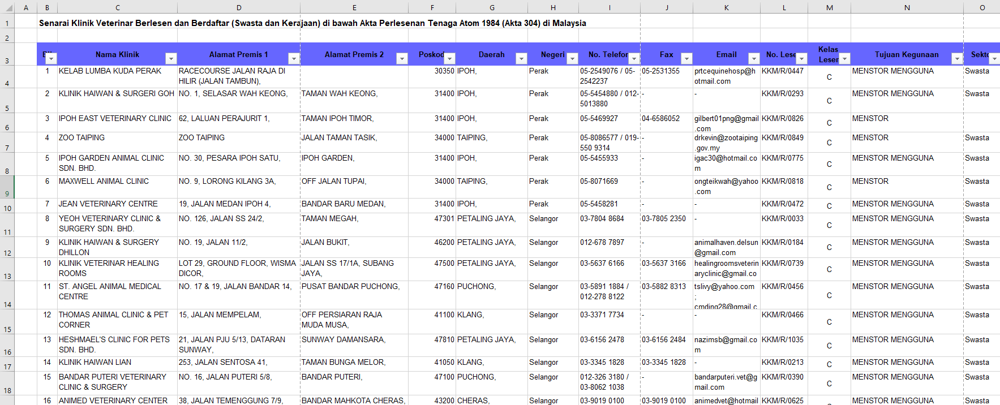

# Malaysia Vet Services Analysis

A data analysis and visualization project focused on animal clinics in Malaysia. The goal is to provide insights into the veterinary industry landscape, including the distribution of clinics, services offered, and other relevant metrics.  

For this project, I am using the [List of Licensed and Registered Veterinary Clinics under Act 304 Datase](https://archive.data.gov.my/data/ms_MY/dataset/senarai-klinik-veterinar-berlesen-dan-berdaftar-di-bawah-akta-304) from data.gov.my.  

## Dataset Overview

